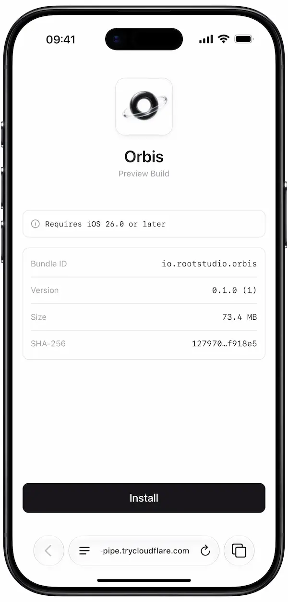

<div align="center">

# Remote Installer

**Install signed iOS and Android builds on real devices over the internet**

Perfect for AI Agents and vibe coding remotely.

No TestFlight or Google Play Beta. No hosted storage. No waiting for processing.

`Remote Desktop → Link / QR code → Phone Install`

</div>

```bash
remote-installer share ./MyAwesome.ipa
```

Remote Installer validates the build, opens a temporary HTTPS link, and prints a QR code. Scan it with the phone camera or open the page in the phone's browser to install.

> iOS: Works with development and ad hoc builds. The target iPhone must already be included in the provisioning profile.
>
> Android: Works with a signed standalone APK. Android App Bundles (`.aab`) and `.apks` sets are not directly installable and are intentionally rejected. Split-only APKs are rejected when `apkanalyzer` is available.

## Features

- Support for `.ipa`, signed device `.app`, and signed standalone `.apk` builds
- Optional expiry and successful-download limits that continue to work across interrupted and resumed range requests
- Automatic provider discovery: starts every installed provider (Tailscale Serve, Tailscale Funnel, and Cloudflare Quick Tunnel)
- Automatic cleanup when sharing ends

Remote Installer distributes an existing build. It does **not** sign, re-sign, register devices, convert App Bundles or split APKs, or make Simulator and App Store builds installable.

## Quick start

### 0. Prerequisites

Remote Installer requires a tunnel provider to share builds over the internet.

It currently supports the following providers:

- [Cloudflare Quick Tunnels](https://developers.cloudflare.com/cloudflare-one/networks/connectors/cloudflare-tunnel/do-more-with-tunnels/trycloudflare/)
- [Tailscale Serve](https://tailscale.com/docs/features/tailscale-serve)
- [Tailscale Funnel](https://tailscale.com/docs/features/tailscale-funnel)

See each provider's documentation for installation and setup instructions.

**Which provider should I choose?**

We recommend Cloudflare Quick Tunnels for most users. They are free and fast, require no Cloudflare account, and are easy to set up.

If Quick Tunnels do not work or are too slow, or if you are already familiar with Tailscale, try Tailscale Serve for private access within your tailnet or Tailscale Funnel for public access over the internet.

### 1. Install Remote Installer

Homebrew:

```bash
brew install icodesign/tap/remote-installer
```

npm:

```
npm install --global @icodesign/remote-installer
```

For a one-off run without installing a command globally using npm:

```bash
npx --yes @icodesign/remote-installer share /path/to/MyApp.ipa
```

The Homebrew and npm distributions currently support macOS arm64 (Apple silicon) and macOS x86_64 (Intel). Other host operating systems are not yet included in the release artifacts. (PRs are welcomed.)

### 2. Share a build

Share .ipa/.app/.apk:

```bash
remote-installer share /path/to/MyApp.app
```

### 3. Install on the phone

1. Keep the command running.
2. Open the link in the phone browser or scan the QR code with the camera.
3. Tap **Install**.



## For AI agents

This repository includes a skill for coding agents:

```bash
npx skills add icodesign/remote-installer
```

Example agent request:

> Create a new build with latest changes for my iPhone, and give me the install URL with remote-installer.

## Common recipes

### One person, one hour

```bash
remote-installer share MyApp.ipa --max-downloads 1 --expire-after 1h
```

The command exits when either limit is reached, after allowing an active download to finish.

### Useful options

| Option                        | Purpose                                                                                                       |
| ----------------------------- | ------------------------------------------------------------------------------------------------------------- |
| `--expire-after 30m`          | Stop sharing after a duration                                                                                 |
| `--timeout 300`               | Stop sharing after a number of seconds                                                                        |
| `--max-downloads 3`           | Stop after a number of successful downloads                                                                   |
| `--no-qr`                     | Do not print the terminal QR code                                                                             |
| `--provider auto` (default)   | Detect and start every installed provider                                                                     |
| `--provider tailscale-serve`  | Keep the link private to your tailnet                                                                         |
| `--provider tailscale-funnel` | Create a public Tailscale link                                                                                |
| `--https-port PORT`           | Tailscale Serve port; auto mode picks another supported Funnel port; `--funnel-port` is a compatibility alias |

Use either `--expire-after` or `--timeout`, not both. Run `remote-installer share --help` for every option.

With the default `--provider auto`, Remote Installer checks for the Tailscale and cloudflared CLIs, starts every provider it can use in parallel, and prints a warning for each unavailable or unready provider. Tailscale Serve and Funnel use different HTTPS ports automatically so both can run in the same share. If you select one provider explicitly, only that provider is started. The terminal labels every result as `Public internet` or `Tailnet only` so the access boundary is visible next to the URL.

Remote Installer does not overwrite an existing Tailscale Serve or Funnel configuration. Auto mode warns and skips Tailscale while another available provider can continue; explicitly selecting the conflicting Tailscale mode returns an error.

Tailscale Serve requires the phone to be on the same tailnet (or otherwise allowed by its access policy). Tailscale Funnel creates a public link and does not require Tailscale on the phone. The older `--provider tailscale` spelling is kept as an alias for `tailscale-funnel`; use the explicit provider name in new commands.

Tailscale's tailnet-wide **MagicDNS** setting is different from each device's **Use Tailscale DNS** (`--accept-dns`) preference. Startup checks both settings: Funnel requires MagicDNS, while disabling DNS on the sharing computer alone does not prevent a correctly configured phone from using Serve. Serve warns when this computer's Tailscale DNS is off; enable it on devices opening the link, or provide equivalent DNS that resolves the hostname to the serving node. Funnel recipients use public DNS and do not need Tailscale DNS. These checks do not change your DNS settings or verify the phone's settings. Use a Tailscale CLI that supports `tailscale dns status --json`. If DNS inspection fails, startup stops with an actionable error instead of assuming the settings are correct.

## Important security notes

- **The full public URL is a capability.** Remote Installer generates an opaque artifact UUID and exposes no directory listing, so a recipient normally needs the complete URL. This is useful risk reduction, not authentication: anyone who obtains or is forwarded a Cloudflare or Funnel URL can install the build.
- The normal workflow distributes an already signed build. Device `.app` signatures, architecture, and provisioning are verified before exposure; IPA archives are checked for signing evidence and a valid device profile. Android signatures are verified when `apksigner` is available. A signature protects build identity and integrity, but does not make a leaked build non-sensitive.
- Only the selected staged artifact and its install resources are served; the source repository and surrounding filesystem are not exposed.
- Use `--expire-after` and `--max-downloads` when sharing with someone else.
- The build remains on your Mac rather than being uploaded for storage.
- Cloudflare Quick Tunnel and Tailscale Funnel links are public. Tailscale Serve keeps access within your tailnet.
- With Cloudflare, TLS terminates at Cloudflare while the build is transferred.
- Stopping the command closes the tunnel and deletes Remote Installer's temporary copy.

## Troubleshooting

| Problem                                   | What to check                                                                                                                                        |
| ----------------------------------------- | ---------------------------------------------------------------------------------------------------------------------------------------------------- |
| **“Unable to Install”**                   | The iPhone UDID is in the embedded profile, the profile is valid, and the app was rebuilt after registering the device.                              |
| **Install button does nothing**           | Open the install page in Safari. Some third-party iOS browsers do not hand the install link to the system.                                           |
| **`cloudflared CLI was not found`**       | Run `brew install cloudflared`, or pass `--cloudflared-bin /path/to/cloudflared`.                                                                    |
| **`Tailscale CLI was not found`**         | Run `brew install --cask tailscale`, or pass `--tailscale-bin /path/to/tailscale`.                                                                   |
| **Serve link does not open**              | Confirm the phone is connected to the tailnet, its access policy allows the host, and Tailscale DNS resolves the hostname to that host's tailnet IP. |
| **`app is not an iphoneos device build`** | Use `Build/Products/Debug-iphoneos/`, not `Debug-iphonesimulator/`.                                                                                  |
| **Provisioning profile expired**          | Refresh signing in Xcode and rebuild.                                                                                                                |
| **Warning: `apkanalyzer was not found`**  | Sharing continues without manifest metadata or split-APK validation. Install Android SDK Command-Line Tools for full checks.                         |
| **Warning: `apksigner was not found`**    | Sharing continues without signature verification. Install Android SDK Build Tools for full checks.                                                   |
| **APK signature verification fails**      | Produce a signed debug or release APK; Remote Installer does not sign it.                                                                            |
| **Android asks to allow this source**     | Allow APK installation for the browser that opened the link, then open the download again.                                                           |
| **Android update is rejected**            | The APK must use the same signing certificate as the installed app and an acceptable version code.                                                   |

Most installation failures are signing or provisioning problems. Remote Installer can validate and distribute a build, but it cannot make an incorrectly signed build installable.

For full APK validation, install the Android SDK `apkanalyzer` and `apksigner` tools. They are discovered from `PATH`, `ANDROID_SDK_ROOT`, `ANDROID_HOME`, and standard SDK locations. Use `--apkanalyzer-bin` and `--apksigner-bin` when the SDK is installed elsewhere. If either tool cannot be discovered, sharing still starts after structural checks and prints a warning describing the skipped validation.
